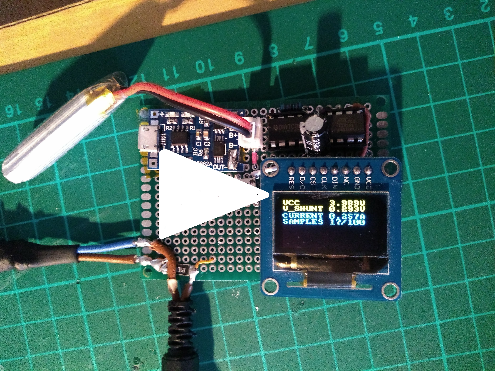

# What's this?

I wanted to be able to easily measure the current consumed by devices I "feed"
via 5.5x2.1mm jacks. To that end, I bought an INA219 sensor, intending to build
a circuit around it to do just that - get the current measurement over I2C, and
display it on an OLED controlled from an ATtiny85. 

Unfortunately, the INA219 sensor was broken - the main chip, as I confirmed
after desoldering it, had a short inside it (from VCC directly to GND). 
I decided to go on with the project regardless, by desoldering the sense resistor
from that PCB, and putting it in series in the (outer) power loop, while
measuring the voltage drop on it via the ATtiny85's ADC.

That voltage drop was too small - so I needed to amplify it with an opamp
first. I had a bunch of LM358, so I used one - and after proper calibration,
I was able to adapt the ADC reading, based on the current VCC on the ATtiny;
thus adapting to whatever the battery voltage is. I basically used the 
internal 1.1V voltage reference to calibrate whatever readings come over
the ADC.

Finally, I concluded the design with a TP4056 that is used to charge the
battery - which is conveniently "shoved" under the OLED screen.

This is probably my most useful "circuit" so far - I thoroughly enjoyed building this!

Click on the image below to watch a video of it in action:

